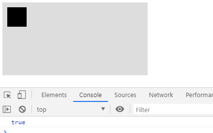
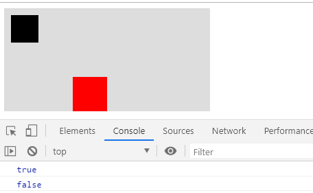
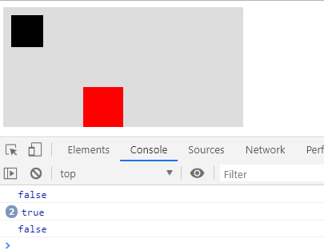
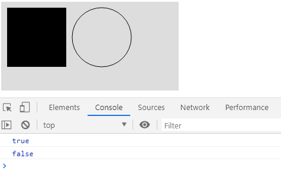

#### 在Canvas中添加事件

在翻阅CanvasAPI的时候，找到了一个方法isPointInPath
isPointInPath的作用：判断点是否处于路径当中。
isPointInPath的入参出参：
  `ctx.isPointInPath([path, ]x, y [, fillRule])`
  该方法的参数有4个，其中path和fillRule为选填，x和y为必填。我们依次介绍4个参数。
- path：看到这个参数，我开始以为是beginPath或者closePath的返回值，很可惜的是这两个方法并没有返回值，在查阅了资料后，发现是Path2D构造函数new的对象。Path2D构造函数具体用法。不过可惜的是该方法可能由于兼容性的问题，目前看了一些开源框架都还未使用。
- x，y：这两个参数很好理解，就是x轴和y轴的距离，需要注意的是，其相对位置是Canvas的左上角。
- fillRule：nonzero（默认），evenodd。非零环绕规则和奇偶规则是图形学中判断一个点是否处于多边形内的规则，其中非零环绕规则是Canvas的默认规则。想具体了解这两种规则的，可以自己去查阅资料，这里就不增加篇幅介绍了。

上面介绍完了入参，那么isPointInPath方法的出参想必大家都可以猜到了，就是true和false。


使用：
 ```js
  const canvas = document.getElementById('canvas')  
  const ctx = canvas.getContext('2d')  
  ctx.beginPath()  
  ctx.moveTo(10, 10)  
  ctx.lineTo(10, 50)  
  ctx.lineTo(50, 50)  
  ctx.lineTo(50, 10)  
  ctx.fillStyle= 'black'  
  ctx.fill()  
  ctx.closePath()  
  canvas.addEventListener('click', function (e) {
    const canvasInfo = canvas.getBoundingClientRect()
    console.log(ctx.isPointInPath(e.clientX - canvasInfo.left, e.clientY - canvasInfo.top))
  })
 ```

如图所示，灰色部分为Canvas所占据的区域，黑色为我们实际添加事件的区域，在我们点击黑色区域后，实际也的确如我们所愿，打印出来的值为true。

我们再来举个例子，这时候有两个区域，并且我们需要分别给其绑定不同的事件：
```js
  const canvas = document.getElementById('canvas')
  const ctx = canvas.getContext('2d')
  ctx.beginPath()  
  ctx.moveTo(10, 10)  
  ctx.lineTo(10, 50)  
  ctx.lineTo(50, 50)  
  ctx.lineTo(50, 10)  
  ctx.fillStyle= 'black'  
  ctx.fill()  
  ctx.closePath()  
  ctx.beginPath()  
  ctx.moveTo(100, 100)  
  ctx.lineTo(100, 150)  
  ctx.lineTo(150, 150)  
  ctx.lineTo(150, 100)  
  ctx.fillStyle= 'red'  
  ctx.fill()  
  ctx.closePath()  
  canvas.addEventListener('click', function (e) {    
    const canvasInfo = canvas.getBoundingClientRect()    
    console.log(ctx.isPointInPath(e.clientX - canvasInfo.left, e.clientY - canvasInfo.top))  
  })
```


这个时候，结果就不再如同我们所预计的一样，当点击其中黑色区域时，打印的值为false，点击红色区域时，打印的值为true。其实原因很简单，因为上述代码，我们实际创建了两个Path，而isPointInPath方法实际只检测当前点是否处于最后一个Path当中，而例子中红色区域为最后一个Path，所以只有点击红色区域时，isPointInPath方法才能判断为true。

所以我们改造一下代码
```js
  vas = document.getElementById('canvas')
  const ctx = canvas.getContext('2d')
  let drawArray = []
  function draw1() {
    ctx.beginPath()
    ctx.moveTo(10, 10)
    ctx.lineTo(10, 50)
    ctx.lineTo(50, 50)
    ctx.lineTo(50, 10)
    ctx.fillStyle = 'black'
    ctx.fill()
  }
  function draw2() {
    ctx.beginPath()
    ctx.moveTo(100, 100)
    ctx.lineTo(100, 150)
    ctx.lineTo(150, 150)
    ctx.lineTo(150, 100)
    ctx.fillStyle = 'red'
    ctx.fill()
    ctx.closePath()
  }
  drawArray.push(draw1, draw2)
  drawArray.forEach(it => { it() })
  canvas.addEventListener('click', function (e) {
    ctx.clearRect(0, 0, 400, 750)
    const canvasInfo = canvas.getBoundingClientRect()
    drawArray.forEach(it => {
      it()
      console.log(ctx.isPointInPath(e.clientX - canvasInfo.left, e.clientY - canvasInfo.top))
    })
  })
```

将每个Path放入到一个单独的函数当中，并将它们push到一个数组当中。当触发点击事件时，我们清空Canvas，并遍历数组重新绘制，每当绘制一个Path进行一次判断，从而在调用isPointInPath方法时，我们能实时的获取当前的最后一个Path，进而判断出当前点所处的Path当中。

现在我们已经间接的实现了对每个Path的单独事件监听，可是其实现的方式需要一次又一次的重绘，那么有办法不需要重绘就能监听事件吗？
首先我们需要知道一次又一次重绘的原因是因为isPointInPath方法是监听的最后一个Path，不过我们在介绍这个方法的时候，说过其第一个参数是一个Path对象，当我们传递了这个参数后，Path就不再去取最后一个Path而是使用我们传递进去的这个Path
```js
  const canvas = document.getElementById('canvas')
  const ctx = canvas.getContext('2d')
  const path1 = new Path2D();
  path1.rect(10, 10, 100, 100);
  ctx.fill(path1)
  const path2 = new Path2D();
  path2.moveTo(220, 60);
  path2.arc(170, 60, 50, 0, 2 * Math.PI);
  ctx.stroke(path2)
  canvas.addEventListener('click', function (e) {
    console.log(ctx.isPointInPath(path1, e.clientX, e.clientY))
    console.log(ctx.isPointInPath(path2, e.clientX, e.clientY))
  })
```

如上图所示，我们点击了左边图形，打印true，false；点击右边图形，打印false，true。打印的结果表明是没有问题的，不过由于其兼容性还有待加强，所以目前建议还是使用重绘方式来监听事件。
